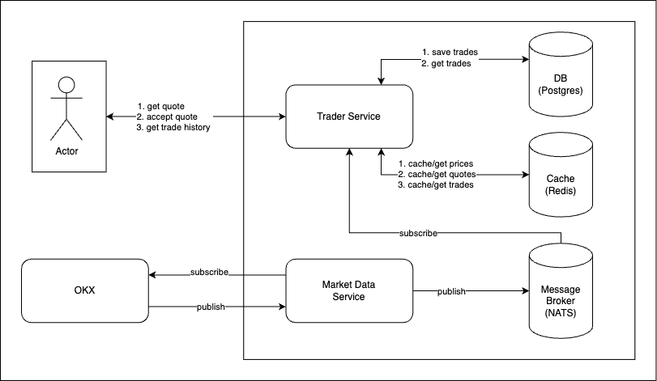

# Mini Trading System

## Why?
I've decided to go with the open category project so that I can showcase a little bit of everything that I can do from architecture design, apis, db management to caching.

## Description
This is a simple subset of a trading system where a user(client), can get and accept quote, create trade and see its own trade history. 
<br /><br />
Here are all the components of this project and technologies used:
- [**OKX**](https://www.okx.com/): This is an actual cryptocurrency platform which will be the souce of our live prices. See [Documentation](https://www.okx.com/docs-v5/en/#order-book-trading-market-data-ws-tickers-channel).
- **Market Data**: This is a microservice responsible for connecting to OKX via Websockets, fetching real-time prices. This also responsible for pushing prices to the *Message Broker(NATS)*.
- **Trader**: This is a microservice responsible for handling *User* trades, saving them to *DB* and *Caching* them for trade history. It will be implemented in *REST* using [**Gin**](https://github.com/gin-gonic/gin).
- **Message Broker**: NATS
- **Database**: Postgres
- **Cache**: Redis
- **User**: It can be a frontend app or anything that can use the *Trader* endpoints to get and accept quotes, and see trade history.

## Architecture Design


## Feature and User Stories
In my previous experience, features, epics, user stories, and tasks are assigned with IDs. These IDs are also used as branch names in the code repo. <br />

For this case, I'll be using **FT-[id]** and **US-[id]** for features and user stories banch names respectively. <br />
Here are the features and user stories I'll be implementing for this project:
- **FT-0001**: Live Market Data and Trading
    - **US-0001**: Project setup, market data service setup and accessible live prices(via terminal).
        - Details: This will include the project structure, the market-data-service with live prices form OKX.
        - Acceptance: 
            - Should be able to run the project via Docker Compose, confiming that all components are properly running
            - Should be able to see live prices(e.g., BTC-USDT, ETH-USDT) via docker logs. Check [how](#confirm-live-prices).
            - Should be able to access live prices via NATS Cli. Check [how](#confirm-live-prices).
    - **US-0002**: User can get and accept quote.
        - Details: This includes trader service setup, redis and postgres setup. User will be able to get and accept quote based on current prices.
        - Acceptance:
            - Should be able to run the project via Docker Compose, confiming that all components are properly running
            - Should be able to see live prices(e.g., BTC-USDT, ETH-USDT) via docker logs. Check [how](#confirm-live-prices)
            - Should be able to get/accept quotes via the get/accept API endpoints. Quote exipry should also be cheked.
    - **US-0003**: User can get own trade history (WILL NOT BE IMPLEMENTED)

## Other Concepts Applied to the Project
- Publish-Subscribe
- Event Driven
- Fan-out
- Domain Driven, Hexagonal, Clean Architecture

## Run
Make sure to cd into the **mini-trader** directory. Also check the [Makefile](./Makefile) definition.
```
$ make up
```
Stop all services
```
$ make down
```

## Confirm Live Prices
Via Docker Logs
```
$ watch docker logs mds
$ watch docker logs ts
```
or via NATS cli
```
$ nats sub prices.BTC-USDT --no-context
$ nats sub prices.ETH-USDT --no-context
```

## Database Schema Migrations
Used golang-migrate for schema migrations. Check [here](https://github.com/golang-migrate/migrate). <br />
This is the command used to create the migrations files. Check them [here](./cmd/trader-service/migrations/).
```
$ migrate create --dir ./cmd/trader-service/migrations -ext sql  init
```

## Testing API Endpoints
Import the api [collection](./local/postman/postman-collection.json) and [env](./local/postman/postman_environment.json) using Postman.

## Improvements
- Unit and Integration Testing
- Data Validation and Logging
- Code Level Documentaion
- Improve Code Stucture
- Others
    